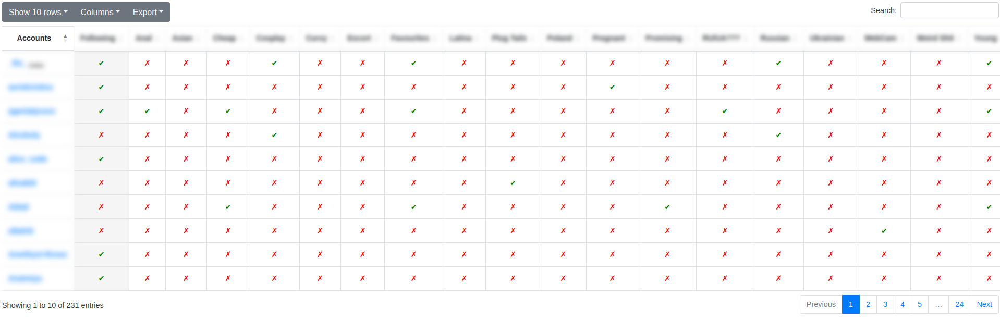

# fansly-utils

A set of useful utils for dumping, restoring and wiping your [fansly.com](fansly.com) account data.

**Table of contents** (generated with [markdown-toc](http://ecotrust-canada.github.io/markdown-toc/))

- [Preface](#preface)
- [Installation](#installation)
- [Preparations](#preparations)
- [Usage](#usage)
  - [Package](#package)
  - [Command Line Tool](#command-line-tool)
    - [Backup](#backup)
    - [Restore](#restore)
    - [Wipe](#wipe)
- [Data visualization](#data-visualization)
  - [Lists](#lists)
  - [Payments](#payments)
- [Notes](#notes)

## Preface

This tool started from a simple JS script to get all accounts from a specific list, which has a lot of limitations and performs very poorly...

```js
var x = "";
Array.from(document.getElementsByClassName("user-name")).forEach((e) => x += e.innerText + "\n" );
console.log(x)
```

## Installation

Download this repository either by [this link](archive/refs/heads/master.zip) or by simply cloning this repo:

```bash
git clone --depth 1 https://github.com/obsessedcake/fansly-utils.git
```

Then install all required python packages:

```bash
python3 -m venv .venv  # optional step
source .venv/bin/activate  # optional step
pip install -e
```

## Preparations

You need to rename [config.tmpl.ini](config.tmpl.ini) into `config.ini` and put a correct data there.

> You can read how to get that data from "[Get Started](https://github.com/Avnsx/fansly-downloader/wiki/Get-Started)" page of [avnsx/fansly-downloader](https://github.com/Avnsx/fansly-downloader) project, which nicely explains how to do that in different ways.

## Usage

This project is exposed in two ways: as a [package](#package) and as a [command line tool](#command-line-tool).

### Package

This project exposes a `fansly_utils` package that exposes [fansly.com](fansly.com) API and can be used as shown below.

```python
from pprint import pprint

from fansly_utils import FanslyApi

api = FanslyApi(
    authorization_token="MyAuthorizationToken",
    user_agent="MyUserAgent",
)

info = api.accounts().get(username="AwesomeCreatorUserName")
pprint(info)
```

It's also worth to mention that `FanslyApi` uses it's own logger instance.
Therefore if you want to configure it, you need to call [logging.basicConfig](https://docs.python.org/3/library/logging.html#logging.basicConfig) before making a new instance of the `FanslyApi` class.

### Command Line Tool

This project also exposes a `fansly-utils` command that has a variety of different sub-commands with rich help messages should answer most of your question.

But I would like to pull up some key points here:

- any command has it's own help message (`fansly-utils -h`, `fansly-utils backup -h`...);
- most of the commands will use `config.ini` as a default configuration file if nothing else is specified;
- most of the commands will use `fansly-backup.json` as a default input/output file for extracted data.

#### Backup

If you want to successfully backup your precious account, you can do that by following command:

```bash
fansly-utils backup
# or
fansly-utils backup -c my-config.ini my-fansly-backup.json
```


Above command will extract following data from your account:

- all followed accounts,
- all user created notes for accounts,
- all lists and their content,
- all payments.

Next time you run `backup` command, you can add `-u` switch to update the existing `json` file. This can be useful if you want to track accounts new usernames and their status (active/deleted).

```bash
fansly-utils backup -u
```

#### Restore

If you have successfully [backup](#backup) all your account's data, you can then restore it using this command:

```bash
fansly-utils restore
```

The following data will be restored:

- a list of followed accounts,
- all user created notes for accounts,
- all lists and their content.

#### Wipe

If you want to wipe most of your account's data, then you need to use below command.
Please take a note that no backup file is needed here, this command will do everything just by using API commands.

```bash
fansly-utils wipe
```

The following actions will be performed:

- all active subscriptions will be canceled,
- all accounts will be unfollowed,
- all user created notes will be erased,
- all lists and their content will be erased.
- all likes will be removed.
- all collections will be removed.
- all your messages will be deleted.
- all your comments to posts will be deleted.

> \- Will this really wipe my data?
>
> \- I don't know, I'm not affiliated with [fansly](fansly.com) by any means.
> You can think about this option as a placebo.
> 1. Even if this really works, there will be some backups of their databases.
> 2. Also there is no way to delete your transaction history, so they still will keep your e-mail and other data for some time if not forever.
> 3. Moreover there is no way to prune your data related to deleted accounts.

## Data visualization

### Lists

You can generate a beautiful HTML table will all accounts and lists to which they are assigned:

```bash
fansly-utils backup --html
# or as a separate sub-command:
fansly-utils html
```



### Payments

You can generate simple text reports for your payments:

```bash
fansly-utils payments --by-accounts
fansly-utils payments --by-years
fansly-utils payments --total
```

## Notes

This project currently uses a bunch of an undocumented and probably not stable internal [Fansly API](fansly.com) functions, that has been figured out by poking around and a bunch of experimentation.
It may not work tomorrow, it may not work in a month, [Fansly](fansly.com) could break it at any moment.
It works now, though.

Taking into an account what has been said, please, be a decent person, don't re-scrape your accounts data too much.
Using this tool once a day is probably a reasonable maximum.
Abuse of their API will likely lead to it being disabled or locked down, and being able to programmatically fetch all your accounts data is too nice of a facility to lose to assholes abusing things.
